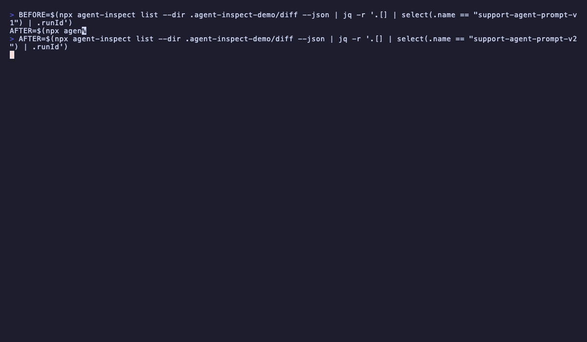
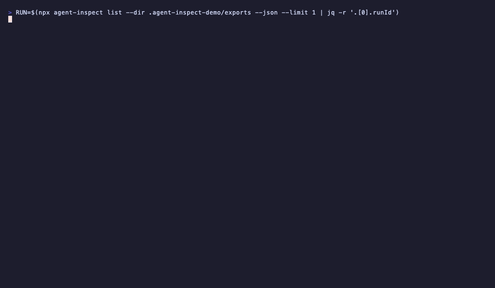
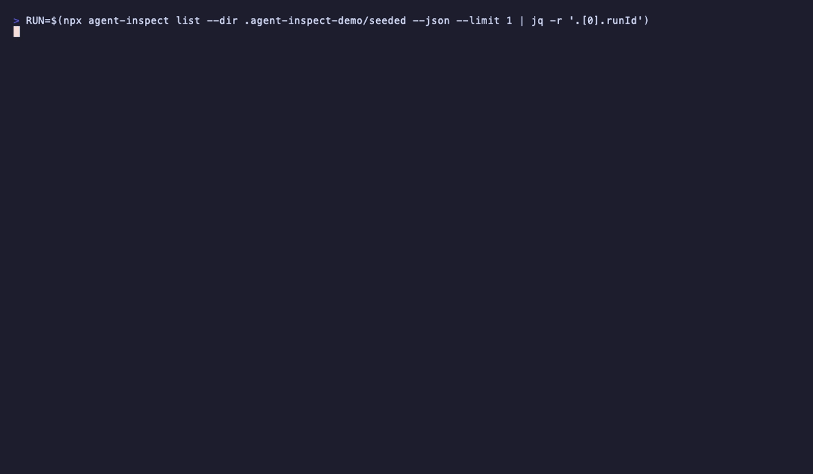

# Visual demos

Curated terminal recordings and static diagrams for AgentInspect **3.5.x**. They show what the local trace workbench captures and how to inspect it — without a hosted dashboard or vendor upload.

**Synthetic output only:** demos use committed [fixtures](../fixtures/README.md), [examples](../examples/README.md), and recipes. No external LLM calls or API keys.

**npm note:** GIFs live in `docs/assets/demos/` for GitHub documentation. They are **not** shipped in the `agent-inspect` npm tarball. Static SVG diagrams in `docs/assets/` are included in the root npm package.

**Re-record guide:** [assets/demos/RECORDING.md](assets/demos/RECORDING.md)
**Maintainer audit:** [implementation/VISUAL-DEMO-AUDIT.md](implementation/VISUAL-DEMO-AUDIT.md)
**Live demo script:** [DEMO-SCRIPT.md](DEMO-SCRIPT.md) (uses [broken-agent-debugging](../examples/starters/broken-agent-debugging/) starter)

---

## Product diagrams (static)

No terminal recording required — safe for README and docs.

| Diagram | Purpose |
| ------- | ------- |
| [agent-inspect-loop.svg](assets/agent-inspect-loop.svg) | Trace → check → redact → share (local only) |
| [trace-check-redact.svg](assets/trace-check-redact.svg) | Workflow from JSONL to share-safe artifact |
| [package-map.svg](assets/package-map.svg) | Core + adapter + quality + safety packages |

Embedded in root [README](../README.md). Workflow: [FIRST-TRACE-IN-5-MINUTES.md](FIRST-TRACE-IN-5-MINUTES.md).

---

## Adoption demo (v3.5.2)

Deterministic broken-agent flow — recommended for live demos and Show HN rehearsal.

**Run:**

```bash
cd examples/starters/broken-agent-debugging
pnpm install && pnpm start
npx agent-inspect report <run-id> --dir .agent-inspect
npx agent-inspect redact .agent-inspect/*.jsonl --profile share -o safe.jsonl
```

**GIF status:** re-record optional; use [error-handling.gif](assets/demos/error-handling.gif) as b-roll until a dedicated broken-agent GIF exists.

---

## Start tracing

Manual `inspectRun` / `step` traces written as local JSONL.

### Quickstart (install → trace → view)


Run: [examples/00-quickstart-demo](../examples/00-quickstart-demo/README.md)  
Also: [GETTING-STARTED.md](GETTING-STARTED.md)

### Nested execution tree


Run: [examples/02-nested-steps](../examples/02-nested-steps/README.md)  
Command: `agent-inspect view <run-id> --dir <trace-dir>`

### Parallel sibling steps


Run: [examples/03-parallel-steps](../examples/03-parallel-steps/README.md)

### Error handling


Run: [examples/04-error-handling](../examples/04-error-handling/README.md)

### `observe()` wrapper


Run: [examples/05-observe-wrapper](../examples/05-observe-wrapper/README.md) · API: [API.md](API.md)

### Env-gated tracing (`maybeInspectRun`)


Docs: [GETTING-STARTED.md](GETTING-STARTED.md) · [API.md](API.md) (`maybeInspectRun`)

---

## Use existing logs

Turn structured logs you already emit into a **local** grouped timeline or tree.

### JSON logs → tree

**Status:** animated demo pending re-record (staging asset had summary-count mismatch).  
**Command:**

```bash
agent-inspect logs ./your.json.log \
  --format json \
  --run-id-key runId \
  --event-key event \
  --timestamp-key timestamp
```

Run: [examples/06-log-to-tree](../examples/06-log-to-tree/README.md) · [LOGS.md](LOGS.md) · [LOG-TO-TREE-QUICKSTART.md](LOG-TO-TREE-QUICKSTART.md)

### Live tail

**Status:** animated demo pending re-record.  
**Command:** `agent-inspect tail <log-file> [mapping flags]` — see [LOGS.md](LOGS.md).

### log4js (best-effort)

**Status:** pending re-record. Documented in [LOGS.md](LOGS.md); recipe: [log4js-json-layout](../examples/recipes/log4js-json-layout/README.md).

---

## Inspect and compare

Read-only CLI over local JSONL traces.

### Chronological timeline (`--focus slow`)


```bash
agent-inspect timeline <run-id> --dir fixtures/traces --focus slow
```

Docs: [CLI.md](CLI.md) § timeline

### Local stats


```bash
agent-inspect stats --dir fixtures/traces
```

Filter by correlation: `agent-inspect stats --correlation-id <id>` or `--group-id <id>`.  
Docs: [CLI.md](CLI.md) § stats

### Deterministic search


```bash
agent-inspect search --dir fixtures/traces --status error --limit 5
```

Docs: [CLI.md](CLI.md) § search

### Diff two runs



```bash
agent-inspect diff minimal-success minimal-error --dir fixtures/traces
```

Docs: [DIFF.md](DIFF.md)

### Markdown export



```bash
agent-inspect export minimal-success --dir fixtures/traces --format markdown
```

Docs: [EXPORTS.md](EXPORTS.md)

### HTML / OpenInference / OTLP

- **HTML:** rendered-report visual pending re-record; export command in [EXPORTS.md](EXPORTS.md).
- **OpenInference / OTLP JSON:** compatibility-oriented local formats — see prose and `--validate` in [EXPORTS.md](EXPORTS.md), not dedicated GIFs.

---

## Integrations and optional UI

### LangChain persistence


Run: [examples/08-langchain-adapter](../examples/08-langchain-adapter/README.md) · [ADAPTERS.md](ADAPTERS.md)

Streaming metadata (`stream: true`) demo pending re-record until `chunkCount` / `streamDurationMs` are non-null.

### Optional TUI (`@agent-inspect/tui`)



Requires optional package: `pnpm add @agent-inspect/tui`  
Command: `agent-inspect view <run-id> --tui`  
Docs: [ADAPTERS.md](ADAPTERS.md)

---

## Safety and sharing

### Default metadata redaction


Profiles (`local` / `share` / `strict`) and export redaction: [SAFE-TRACE-SHARING.md](SAFE-TRACE-SHARING.md)

### Event size bounds

Described in [LIMITATIONS.md](LIMITATIONS.md) — no GIF (static explanation preferred).

### Correlation metadata

Described in [API.md](API.md) — optional `correlationId`, `requestId`, `decisionId`, `groupId` on `run_started`.

---

## VS Code (v3.3)

Read-only sidebar trace explorer backed by the `agent-inspect` CLI. Develop with F5 from `packages/vscode`.

Guide: [VSCODE.md](VSCODE.md)

- [x] Basic trace tree (`inspectRun` + `step`)
- [x] Failed step rendering
- [x] `agent-inspect logs` output (JSON) — **re-record pending**
- [x] `agent-inspect diff` output
- [x] Optional TUI (`view --tui`)
- [x] `timeline`, `stats`, `search` (v1.4.0)
- [x] VS Code read-only trace explorer (v3.3.0) — see [VSCODE.md](VSCODE.md); Marketplace GIF pending first publish
