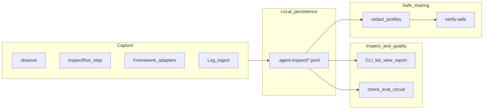

# AgentInspect Technical Guide

**Version:** 3.5.3 · **Audience:** TypeScript agent developers, platform engineers, tech leads  
**Purpose:** Source-of-truth technical overview for adoption content (blogs, articles, emails, demos).  
**Status:** Grounded in shipped code and docs as of v3.5.3. Not a compliance or marketing guarantee.

---

## 1. Thesis

AgentInspect is a **local-first TypeScript toolkit** for AI agents. It helps you:

1. **Trace** what happened — capture runs and nested steps as a local execution tree  
2. **Check** what should have happened — deterministic rules and eval heuristics in CI  
3. **Redact** what must not leave your machine — profiles before sharing artifacts  

**North star:** install → one trace → one failure check → one share-safe artifact in under five minutes.

**Principles:** CLI-first · TypeScript-first · dependency-light at the root · safe by default · framework-aware but not framework-locked · **no account · no upload · no hosted dashboard** · metadata-only by default.

---

## 2. The problem

AI agents are not linear scripts. A single user request can fan out into parallel tool calls, nested LLM rounds, retries, handoffs, and MCP invocations. `console.log` gives you a **flat stream** — you see lines, not structure.

| Pain | Why flat logs fail |
| ---- | ------------------ |
| Wrong tool selected | You see a tool name, not sibling steps or parent run context |
| Eval/test failure | Assertion message only; no step-level evidence |
| Silent stall | No duration boundaries or step tree to spot hung work |
| Incident handoff | Raw logs may contain secrets; no share-safe workflow |
| Multi-agent flows | Handoffs span runs; hard to reconstruct causality |

**Hosted observability** (LangSmith, Langfuse, Braintrust, OTel backends) excels at retention, dashboards, and fleet-scale monitoring. AgentInspect targets the **inner loop**: local debugging, PR artifacts, and deterministic checks **before** you need a vendor account or collector setup.

AgentInspect is **complementary**, not a replacement. See [COMPARE.md](./COMPARE.md).

---

## 3. Core idea: the execution tree

AgentInspect models agent work as a **tree of runs and steps**, persisted as **JSONL files** on disk (default directory `.agent-inspect/` or `AGENT_INSPECT_TRACE_DIR`).

### 3.1 Manual trace events (schema 0.1)

Written by `inspectRun()`, `step()`, and `observe()`:

| Event | Meaning |
| ----- | ------- |
| `run_started` | Top-level workflow begins |
| `step_started` | Nested unit of work begins |
| `step_completed` | Step ends (success or error) |
| `run_completed` | Run ends |

**Important:** There is no `step_failed` event. Failures use `step_completed` with `status: "error"`.

Step types include **tool**, **LLM**, and custom names. Convenience helpers: `step.tool(name, fn)` and `step.llm(model, fn)`.

### 3.2 Persisted InspectEvent (schema 1.0)

Framework adapters and `createInspector()` / writers can emit **schema 1.0** persisted rows. Manual global tracing remains 0.1 for compatibility. Readers normalize multiple schema versions for CLI inspection.

### 3.3 Log-derived trees

Structured JSON logs can be ingested via `agent-inspect logs` / `tail` into normalized in-memory trees with **confidence labels** (`explicit`, `correlated`, `heuristic`, `unknown`). Log-derived views are not identical to manual JSONL fidelity.

### 3.4 Product loop



---

## 4. System architecture

### 4.1 Package layout

| Package | Published | Role |
| ------- | --------- | ---- |
| `agent-inspect` | Yes | Core tracing APIs + CLI binary |
| `@agent-inspect/core` | No (private) | Tracing, storage, readers, checks, export |
| `@agent-inspect/cli` | No (private) | Commander CLI implementation |

The root `agent-inspect` tarball ships core + CLI. Heavy optional deps stay in scoped packages.

### 4.2 Public package ecosystem (v3.5.3)

Sixteen linked npm packages at **3.5.3**:

| Tier | Package | Purpose |
| ---- | ------- | ------- |
| **Core** | `agent-inspect` | `observe`, `inspectRun`, `step`, CLI |
| **Framework** | `@agent-inspect/ai-sdk` | Vercel AI SDK telemetry integration |
| | `@agent-inspect/openai-agents` | OpenAI Agents JS tracing processor |
| | `@agent-inspect/langchain` | LangChain callback adapter |
| **Real projects** | `@agent-inspect/harness` | Fixture runner (bootstrap → invoke → shutdown) |
| **Quality** | `@agent-inspect/eval` | Deterministic eval heuristics over traces |
| | `@agent-inspect/vitest` | Vitest reporter (artifacts on failure) |
| | `@agent-inspect/jest` | Jest reporter |
| | `@agent-inspect/guardrails` | Deterministic guardrail rules |
| | `@agent-inspect/circuit` | Loop/retry/stall analyzers |
| **Safety** | `@agent-inspect/redact` | JSON/trace redaction (`local` / `share` / `strict`) |
| **Inspect UX** | `@agent-inspect/viewer` | Localhost read-only viewer |
| | `@agent-inspect/tui` | Optional terminal UI (`view --tui`) |
| | `@agent-inspect/mcp-server` | Read-only MCP server for trace listing |
| **Extensibility** | `@agent-inspect/mcp` | MCP **client** tool-call tracing |
| | `@agent-inspect/adapter-sdk` | Third-party adapter authoring + conformance |

**In-repo (not on Marketplace yet):** `agent-inspect-vscode` — read-only trace explorer via F5 dev host. See [VSCODE.md](./VSCODE.md).

Each scoped package has its own README on npm.

### 4.3 Instrumentation safety

Tracing, stepping, and observation **must not throw into user code** in ways that break the agent. Failures in instrumentation degrade gracefully (warn, skip event, continue). User errors inside `fn` are re-thrown unchanged.

---

## 5. Five capture paths

| Path | When | Entry |
| ---- | ---- | ----- |
| **Observe** | Existing class with `run` / `execute` / `invoke` | `observe(agent, { traceDir })` |
| **Manual** | Custom control flow, explicit step names | `inspectRun` + `step` / `step.tool` / `step.llm` |
| **AI SDK** | Vercel AI SDK `generateText` / `streamText` | `@agent-inspect/ai-sdk` + `recordInputs: false`, `recordOutputs: false` |
| **OpenAI Agents** | OpenAI Agents JS | `@agent-inspect/openai-agents` local-only processor mode |
| **LangChain** | Callback-based chains / LangGraph-via-LangChain | `@agent-inspect/langchain` with `persist: true` |
| **Logs** | Structured JSON logs already emitted | `agent-inspect logs` / `tail` |
| **Harness** | Real app (NestJS, etc.) with fixtures | `@agent-inspect/harness` + starters |

**Blessed starters** (no API keys): [examples/starters](../examples/starters/README.md)

**Quick bootstrap:**

```bash
npm install agent-inspect
npx agent-inspect init --yes
node examples/agent-inspect-demo.mjs
```

---

## 6. CLI workbench

All commands run locally. No network required.

### 6.1 Onboarding

| Command | Purpose |
| ------- | ------- |
| `init` | Config, trace dir, deterministic demo |
| `doctor` | Node, permissions, optional packages |

### 6.2 Browse and understand

| Command | Purpose |
| ------- | ------- |
| `list` | Runs in a trace directory |
| `view` | Execution tree in terminal (optional `--tui`, `--serve`) |
| `timeline` | Chronological view (e.g. `--focus slow`) |
| `what` | Concise run summary |
| `report` | Markdown/HTML report |
| `explain` | Local analysis dry-run |
| `sessions` / `session` | Multi-run session grouping |
| `search` | Filter by status, kind, etc. |
| `stats` | Aggregate directory metrics |
| `serve` | Localhost viewer |

### 6.3 Compare and migrate

| Command | Purpose |
| ------- | ------- |
| `diff` | Compare two runs (baseline vs candidate) |
| `open` | Open trace with format detection |
| `migrate` | Explicit schema migration (non-destructive) |

### 6.4 Quality gates

| Command | Purpose |
| ------- | ------- |
| `check` | Deterministic trace rules (duration, stalls, tool usage, etc.) |
| `eval` | Eval heuristics over traces |
| `scan` | Safety scan |
| `verify-safe` | Verify artifact is share-safe |
| `artifacts` / `ci-summary` | CI-oriented summaries |

**Example CI check:**

```bash
npx agent-inspect check .agent-inspect/*.jsonl --require-completed --detect-stalls
```

### 6.5 Safe sharing

| Command | Purpose |
| ------- | ------- |
| `export` | Markdown, HTML, OpenInference, OTLP JSON (local files) |
| `redact` | Copy with redaction profile |

### 6.6 Logs and scale

| Command | Purpose |
| ------- | ------- |
| `logs` / `tail` | Ingest structured logs |
| `index build` / `status` / `clean` | Optional metadata index for large directories |
| `clean` | Verified trace deletion |

### 6.7 End-to-end debug flow

```bash
cd examples/starters/broken-agent-debugging && pnpm install && pnpm start
npx agent-inspect report <run-id> --dir .agent-inspect
npx agent-inspect check .agent-inspect/*.jsonl
npx agent-inspect redact .agent-inspect/*.jsonl --profile share -o safe.jsonl
npx agent-inspect verify-safe safe.jsonl
```

---

## 7. Programmatic API

### 7.1 Stable root exports

```ts
import {
  createInspector,
  observe,
  inspectRun,
  maybeInspectRun,
  step,
  getCurrentCorrelationMetadata,
} from "agent-inspect";
```

| API | Use |
| --- | --- |
| `inspectRun(name, fn, opts?)` | Wrap workflow; writes JSONL |
| `maybeInspectRun` | Env-gated via `AGENT_INSPECT` |
| `step(name, fn)` | Named step inside a run |
| `step.tool` / `step.llm` | Typed step shortcuts |
| `observe(agent, opts?)` | Proxy `run`/`execute`/`invoke` |
| `getCurrentCorrelationMetadata()` | Active correlation IDs inside a run |

**Defaults:** metadata redaction before disk; size bounds on events; `enabled: false` skips tracing entirely.

### 7.2 Subpath exports (advanced / experimental)

| Subpath | Examples |
| ------- | -------- |
| `agent-inspect/logs` | `parseLogsToTrees` |
| `agent-inspect/exporters` | Markdown, HTML, OpenInference, OTLP JSON export |
| `agent-inspect/writers` | `fileWriter`, custom persistence |
| `agent-inspect/readers` | `openTrace`, multi-format read |
| `agent-inspect/checks` | `runTraceChecks`, rule factories |
| `agent-inspect/diff` | `diffTraceEvents` |
| `agent-inspect/persisted` | Schema 1.0 types and converters |
| `agent-inspect/advanced` | Runtime helpers, redaction profiles |
| `agent-inspect/reporters` | Reporter utilities |

See [API.md](./API.md) for stability classification.

### 7.3 Check rule families (deterministic)

Built-in check rules include (non-exhaustive): run status/duration, max step duration, stall detection, require-completed, tool usage/ordering/failures, LLM usage, structure (orphans, cycles, parallel width), retrieval, guardrails, decision metadata, safety (redaction, raw content, secret patterns, oversized attributes), baseline regression.

**No LLM-as-judge** in core checks or `@agent-inspect/eval`.

---

## 8. Framework adapters (high level)

### 8.1 AI SDK (`@agent-inspect/ai-sdk`)

- Explicit `experimental_telemetry.integrations` wiring — no monkey-patching  
- **Required:** `recordInputs: false`, `recordOutputs: false` on AI SDK calls  
- Metadata-only: model, timing, token counts, tool names — not raw prompts/outputs  
- Guide: [AI-SDK-ADOPTION.md](./AI-SDK-ADOPTION.md)

### 8.2 OpenAI Agents (`@agent-inspect/openai-agents`)

- `TracingProcessor` for local JSONL  
- **Local-only mode:** use `setTraceProcessors` replacement, not `addTraceProcessor`, to avoid default cloud export  
- Maps agents, tools, handoffs, guardrails as metadata  
- Guide: [OPENAI-AGENTS-LOCAL.md](./OPENAI-AGENTS-LOCAL.md)

### 8.3 LangChain (`@agent-inspect/langchain`)

- `AgentInspectCallback` with `persist: true`  
- LangGraph supported through LangChain callback surfaces  
- Guide: [ADAPTERS.md](./ADAPTERS.md)

### 8.4 MCP

- `@agent-inspect/mcp` — trace **client** tool list/call lifecycle only  
- `@agent-inspect/mcp-server` — read-only trace access for IDE agents; no tool invocation, no mutation

---

## 9. CI and test integration

| Surface | Behavior |
| ------- | -------- |
| `@agent-inspect/vitest` | On test failure, write trace artifacts; passing tests stay quiet |
| `@agent-inspect/jest` | Same pattern for Jest |
| `agent-inspect check` | Gate merges on trace shape, completion, stalls |
| `agent-inspect eval` | Heuristic findings with evidence paths |
| CI artifacts | Upload `.agent-inspect/**/*.jsonl`; reviewer runs `report` locally |

Workflow: [CI-ARTIFACTS.md](./CI-ARTIFACTS.md) · Starter: [ci-eval-redact](../examples/starters/ci-eval-redact/)

---

## 10. Safety and privacy model

| Property | Behavior |
| -------- | -------- |
| Storage | Local JSONL only |
| Upload | **None** by default; AgentInspect does not phone home |
| Capture default | Metadata-only; no raw prompts/outputs unless you opt in |
| Redaction before disk | Common sensitive keys stripped on manual traces |
| Profiles | `local` → `share` → `strict` for export/redact |
| Verification | `scan`, `verify-safe` before attaching to issues |
| Instrumentation | Failures degrade gracefully; never break user agent |
| Compliance | **Not** a DLP or compliance engine — human review still required |

Details: [SAFE-TRACE-SHARING.md](./SAFE-TRACE-SHARING.md) · [SECURITY.md](../SECURITY.md)

---

## 11. Performance and scale (honest limits)

AgentInspect optimizes for **developer workflows**, not production APM.

| Workload | Comfortable | Warning threshold |
| -------- | ----------- | ----------------- |
| Runs per directory | ≤ 1,000 | 1,000–10,000 (consider index/archive) |
| Events per run | ≤ 10,000 | 10,000–50,000 |
| Single trace file | ≤ 10 MB | 50 MB+ |

Optional: `agent-inspect index build` for large directories. See [PERFORMANCE.md](./PERFORMANCE.md) and [SCALE-LIMITS.md](./SCALE-LIMITS.md).

---

## 12. Positioning matrix

| Need | AgentInspect | Alternative |
| ---- | ------------ | ----------- |
| Local agent debugging | **Strong** | console.log (flat) |
| No-account CLI tracing | **Strong** | Hosted platforms |
| Deterministic CI checks | **Good** | Braintrust eval platform |
| Share-safe redacted copy | **Good** | Manual scrubbing |
| Production dashboards | Not the goal | Langfuse, LangSmith |
| Hosted eval datasets | Not the goal | Braintrust, LangSmith |
| Prompt registry | Not the goal | Langfuse, etc. |
| Fleet-wide OTel pipelines | Not the goal | OTel + collector + backend |
| Standards export | Partial (local OpenInference/OTLP JSON) | Phoenix, OTel |

Full comparison: [COMPARE.md](./COMPARE.md)

---

## 13. What AgentInspect is not

- Hosted SaaS or dashboard product  
- Production APM replacement  
- Eval dataset platform or LLM-as-judge service  
- Prompt registry or pricing/cost engine  
- Default telemetry uploader or replay/cassette engine  
- Raw chain-of-thought recorder  
- Universal monkey-patching framework  
- Compliance certification from redaction alone  

See [LIMITATIONS.md](./LIMITATIONS.md).

---

## 14. Real-world scenarios

| # | Problem | Mechanism | Starter / doc |
| - | ------- | --------- | ------------- |
| 1 | Wrong tool call | `view`, `report` | [broken-agent-debugging](../examples/starters/broken-agent-debugging/) |
| 2 | Eval failure — which step? | `check`, `@agent-inspect/vitest` | [ci-eval-redact](../examples/starters/ci-eval-redact/) |
| 3 | CI PR artifact | upload + `redact` + `verify-safe` | [CI-ARTIFACTS.md](./CI-ARTIFACTS.md) |
| 4 | Framework-native trace | adapter packages | [starters](../examples/starters/) |
| 5 | Safe incident handoff | `redact --profile share` | [SAFE-TRACE-SHARING.md](./SAFE-TRACE-SHARING.md) |
| 6 | Multi-agent / sessions | `sessions`, `search`, `diff` | [USE-CASES.md](./USE-CASES.md) |
| 7 | MCP tool tracing | `@agent-inspect/mcp` | [ADAPTERS.md](./ADAPTERS.md) |
| 8 | Team adoption sprint | one agent, one check, one artifact | [DESIGN-PARTNER-GUIDE.md](./DESIGN-PARTNER-GUIDE.md) |
| 9 | VS Code review | in-repo extension | [VSCODE.md](./VSCODE.md) |
| 10 | Existing logs only | `logs`, `tail` | [LOG-TO-TREE-QUICKSTART.md](./LOG-TO-TREE-QUICKSTART.md) |

Full index: [USE-CASES.md](./USE-CASES.md) · [TEAM-WORKFLOWS.md](./TEAM-WORKFLOWS.md)

---

## 15. Adoption personas

| Persona | Pain | AgentInspect answer |
| ------- | ---- | ------------------- |
| **Solo agent developer** | Flat logs, wrong tool | Local tree + `report` in 60 seconds |
| **CI maintainer** | Failed test, no evidence | Vitest/Jest reporter + `check` gates |
| **Platform / security** | No-cloud data constraint | Disk-only traces, explicit redact |
| **Framework owner** | Manual wrapping tedious | AI SDK / OpenAI Agents / LangChain adapters |
| **Design partner lead** | Team needs one win in a sprint | [DESIGN-PARTNER-GUIDE.md](./DESIGN-PARTNER-GUIDE.md) |

Daily workflow: capture → inspect → verify → share safely → scale. See [ADOPTION.md](./ADOPTION.md).

---

## 16. Content creation appendix

Reuse these blocks in blogs, emails, and comments. All statements are accurate to v3.5.3; adjust version numbers when publishing.

### 16.1 Elevator pitches

**30 seconds:**  
AgentInspect is a local-first TypeScript toolkit for AI agents. It writes execution trees to JSONL on your machine — no account, no upload. Inspect with the CLI, run deterministic checks in CI, and redact before sharing. It complements LangSmith and Langfuse for the inner loop.

**60 seconds:**  
When an agent calls the wrong tool or a test fails, flat logs are not enough. AgentInspect captures runs and nested steps locally, lets you `report` and `diff` failures, and gates CI with deterministic `check` rules — no LLM judge. Framework adapters exist for AI SDK, OpenAI Agents, and LangChain. Metadata-only by default; redact before posting traces anywhere.

**120 seconds (technical):**  
Add `observe()` or a framework adapter, get JSONL under `.agent-inspect/`, then use `agent-inspect list`, `view`, `report`, `check`, and `redact --profile share`. Sixteen npm packages cover adapters, eval, redaction, MCP tracing, harness fixtures, and test reporters. Schema 1.0 persisted events; readers handle 0.1/0.2/1.0. Not production APM — local debug and share-safe artifacts first.

### 16.2 Pull quotes (factual)

- "Traces stay on your disk. AgentInspect does not upload them."
- "Metadata-only by default — not a chain-of-thought recorder."
- "Deterministic checks, not LLM-as-judge evals."
- "Wrong tool call? See the step tree, not just a log line."
- "Redact before Slack, GitHub, or email — `local`, `share`, `strict` profiles."
- "Works before you set up OpenTelemetry or a hosted dashboard."
- "Framework-aware: AI SDK, OpenAI Agents, LangChain — optional packages."
- "Instrumentation failures degrade gracefully; your agent keeps running."

### 16.3 Blog post outlines

**A. First trace in 5 minutes**  
Hook (flat logs) → `npm install` → `init` → demo → `list` / `report` → `check` → `redact` → link to starters.

**B. Debug the wrong tool call**  
broken-agent-debugging starter → `report` highlights error step → fix → `diff` before/after → redact for issue attachment.

**C. CI trace artifacts without a vendor account**  
Vitest reporter → upload artifact → `verify-safe` → reviewer workflow → contrast with hosted APM.

### 16.4 FAQ (for comments and emails)

| Question | Answer |
| -------- | ------ |
| Does it upload traces? | No. Local files only. |
| Replace LangSmith? | No. Complementary for local inner loop. |
| Store full prompts? | Not by default. Metadata-only; opt-in is caller responsibility. |
| LLM judge evals? | No. Deterministic heuristics and rules only. |
| VS Code extension? | In-repo; F5 dev host. Marketplace not published yet. |
| Node version? | Node 20+ recommended; run `doctor`. |
| Monorepo? | `pnpm build` at root; starters use workspace packages. |
| OpenTelemetry? | Local OTLP JSON export possible; not a full OTel SDK. |
| Compliance? | Redaction helps; not certification or DLP. |

### 16.5 Objection handlers (engineering managers)

| Objection | Response |
| --------- | -------- |
| "We already use Langfuse" | Use AgentInspect locally for PR/debug artifacts; Langfuse for retention and dashboards. |
| "Another dependency" | Root package is dependency-light; adapters are optional scoped packages. |
| "Security review" | No network, no account, metadata defaults, redact profiles, SECURITY.md policy. |
| "Will it slow our agents?" | Instrumentation is bounded; failures are swallowed; disable with `AGENT_INSPECT=0`. |

### 16.6 Demo and launch assets

| Asset | Location |
| ----- | -------- |
| Live 3-min demo | [DEMO-SCRIPT.md](./DEMO-SCRIPT.md) |
| Video script | [VIDEO-WALKTHROUGH-SCRIPT.md](./VIDEO-WALKTHROUGH-SCRIPT.md) |
| Show HN draft | [SHOW-HN-DRAFT.md](./SHOW-HN-DRAFT.md) |
| GIF demos | [SCREENSHOTS.md](./SCREENSHOTS.md) |
| Pitch | [PITCH.md](./PITCH.md) |

---

## 17. References

| Topic | Doc |
| ----- | --- |
| Docs index | [README.md](./README.md) |
| Getting started | [GETTING-STARTED.md](./GETTING-STARTED.md) |
| 5-minute path | [FIRST-TRACE-IN-5-MINUTES.md](./FIRST-TRACE-IN-5-MINUTES.md) |
| API | [API.md](./API.md) |
| CLI | [CLI.md](./CLI.md) |
| Schema | [SCHEMA.md](./SCHEMA.md) |
| Adapters | [ADAPTERS.md](./ADAPTERS.md) |
| Examples | [examples/starters](../examples/starters/) · [recipes](../examples/recipes/) |
| Changelog | [CHANGELOG.md](../CHANGELOG.md) |
| Roadmap | [ROADMAP.md](../ROADMAP.md) |
| Discussions | [GitHub Discussions](https://github.com/rajudandigam/agent-inspect/discussions) |

---

*AgentInspect v3.5.3 — local-first trace workbench for TypeScript AI agents. MIT license.*
